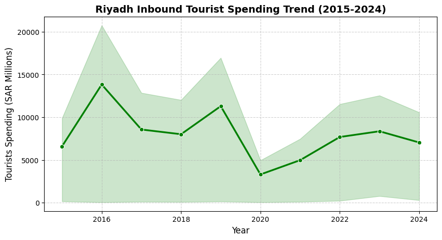

# 🇸🇦 Riyadh Inbound Tourism Analysis (Saudi Vision 2030)

## 📌 Project Overview
This project provides an end-to-end data analysis of Riyadh's inbound tourism metrics from **2015 to 2024**. Using **Python (Pandas, Seaborn)** and **Power BI**, the analysis evaluates key indicators such as tourist volume, length of stay, and total tourist expenditure to uncover post-COVID recovery patterns aligned with Saudi Arabia's **Vision 2030** economic transformation goals.

---

## 📊 Key Business Takeaways
* **Post-COVID Economic Recovery:** Inbound tourist spending in Riyadh experienced a **+152.5% growth** from its lowest point in 2020 (**SAR 9.93 Billion**) to its peak recovery in 2023 (**SAR 25.08 Billion**).
* **Length of Stay & Expenditure Correlation:** Analyzing visitor stay durations highlighted a shift toward higher-value long-stay tourism post-2021.

---

## 🛠️ Tech Stack & Tools
* **Language & Libraries:** Python 3, Pandas (Data Cleaning & Wrangling), Matplotlib & Seaborn (Exploratory Data Analysis)
* **Business Intelligence:** Power BI Desktop (Interactive KPI Dashboards & Year Slicers)
* **Environment:** Google Colab, Jupyter Notebooks

---

## 📁 Repository Structure
├── Riyadh_Tourism_Vision2030_Analysis.ipynb   # Complete Python EDA & cleaning code
├── Cleaned_Riyadh_Tourism_Data.csv             # Cleaned dataset ready for Power BI
├── riyadh_tourism_spending_trend.png          # High-res spending trend visualization
└── README.md                                   # Project documentation
---

## 📈 Visual Highlights

---

## 👤 Author
* **Role:** Entry-Level Data / BI Analyst
* **Focus:** Data Analytics, Regional Economic Insights (KSA / GCC)
